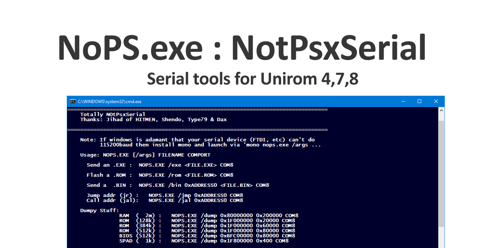

# NoPS - NotPsxSerial
Feb 2020 - github.com/JonathanDotCel

Serial transfer suite for Playstation 1 / Unirom

# Features

    * Kernel-resident debugging
    Debug running games on a retail console

    * Cart/EEPROM flasher
    Back up and reflash cheat carts

    * .EXE or raw binary upload
    Run homebrew utilities or upload assets for development
    
    * Memorycard tools
    Backup or rewrite whole memory cards to raw (emulator) format
    
    * Peeks n Pokes
    Peek or poke running games/homebrew like cheat codes
    
    * Mem dumps
    Grab a copy of RAM, cart EEPROM, BIOS, etc

    * In progress: GDB TCP->SIO bridge!
    Step through your code in the editor, etc

## Upgrading to UniROM:
    
   Specific instructions for doing that can be found in the Unirom Download,
   on PSXDev.net or on the unirom github at (http://github.com/JonathanDotCel)

## Supported configs:

### Cables:
  * Basic 3 wire TX/RX jobs
   (e.g. a 3 quid dongle off amazon and a couple of wires)
  * Sharklink with UART handshake
  * Yaroze cables.

### OS:
  * Windows via .NET or Mono
  * OSX / Linux via Mono

## Basic Usage

The hello world test executable was written by Shadow of PSXDev.net.
To run it:
* nops /exe psx_helloworld.exe COM8

Where COMPORT might be COM3, COM14, etc under windows and /dev/ttyWhatever under *nix with mono.
Find it by opening devmgmt.msc from the run box.

e.g.
* nops /rom unirom_s.rom COM14
* nops /rom unirom_s.rom /dev/ttyUSB01

Once you've specified a com port in this directory, it will be saved to COMPORT.TXT

so next time around you just need to:

* nops /rom unirom_s.rom

### Uploading Stuff

Your basic "Upload to the PSX features are"

* nops /exe whatever.exe
* nops /rom whatever.rom
* nops /bin 0x80?????? somefile.whatever

Where /exe executs a file from the header information, /rom will attempt to identify the JEDEC chip and flash it, and /bin will just upload a binary file to a specific address.

### Flow Control

To jump to an address
* nops /jump 0x80?????? 

To call an address (and return)
* nops /call 0x80?????? 

To poke an 8, 16 or 32 bit value
* nops /poke8 0x80100000 0x01
* nops /poke16 0x801F0012 0xFFEE
* nops /poke32 0xA000C000 0x00112233

### Reading data

 And to get the information back:
 nops /dump 0x80???? 0xSIZE

### Misc

returns PONG!
* nops /ping 

Restart the machine
* nops /reset

### Other operators:

/m
Use in conjunction with anything else to keep the serial connection open and view printf/TTY logs:
E.g.
nops /exe whatever.exe /m
nops /rom whatever.rom /m

or simply
nops /m
if you just want to listen.

/fast
Bumps the baudrate from 115200 to 518400 (4 and a bit times faster).
Can be used solo to put unirom into /fast mode or can be used standalone.
e.g.
* nops /fast
* nops /fast /rom unirom_s.rom /m COM14

Note: Once you've done e.g. 
* nops /fast /dump
 unirom will be in fast mode... Everything untill you reset will require /fast also.

### Debug operators:

These functions will only work when the Unirom is in kernel debug mode.
It copies a small SIO/Debug handler into unused kernel memory and remains resident through gameplay.

To do this hit L1+Square, or send 
nops /debug
You may now start a game, and continue to use everything above + special debug features.

Note!
If the game crashes while the kernel debugger is running, halt will be run as below.
You will not see the reglar register dump screen.

#### Halt and continue:
* nops /halt
* nops /cont
halt triggers an interrupt from the SIO hand holds it in a wait loop - essentially pausing the pSX
cont will continue from the halt state

Note: You won't see the exception handler if the game crashes in debug mode, you'll be notified over SIO though!

Note: There are several ways to enter the /halt state
      - game crashes in debug mode
      - you called nops /halt
      - a hook triggered

nops /cont returns from this. Even for some crashes!

#### Registers

nops /regs 
View registers 
(do it while halted)

nops /setreg
Lets you alter the values of one of the registers
(again, while halted)

e.g.
nops /setreg pc 0xBFC00000
will set the next address to "restart the sytem"
nops /cont
will apply the above and restart

#### Hooks

nops /hookread 0xADDR
nops /hookwrite 0xADDR
nops /hookex 0xADDR
Hooks read, write or exec (respectively) each clears the other.
Enters the /halt state

#### GDB bridge

nops /GDB
This is in progress

## A big thanks:
      While NoPS has been re-written from the ground up for Unirom 8, before that it was
      a decompiled version of Shadow's PSXSerial with the header changed to reflect that.
      (Or more specifically to deny that). In keeping with what I've just decided is tradition,
      we're going with the same motif.

    
 
